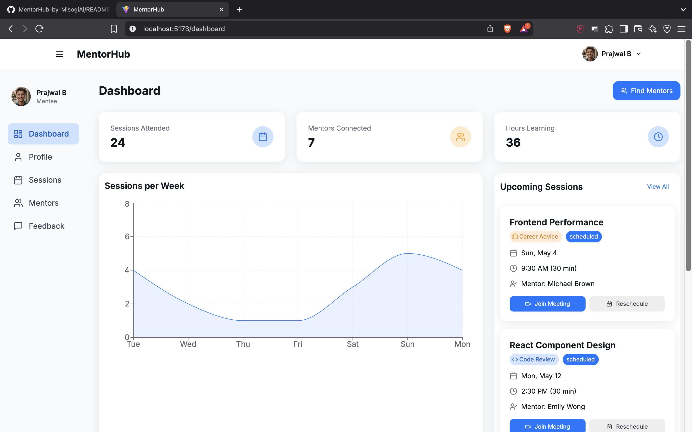
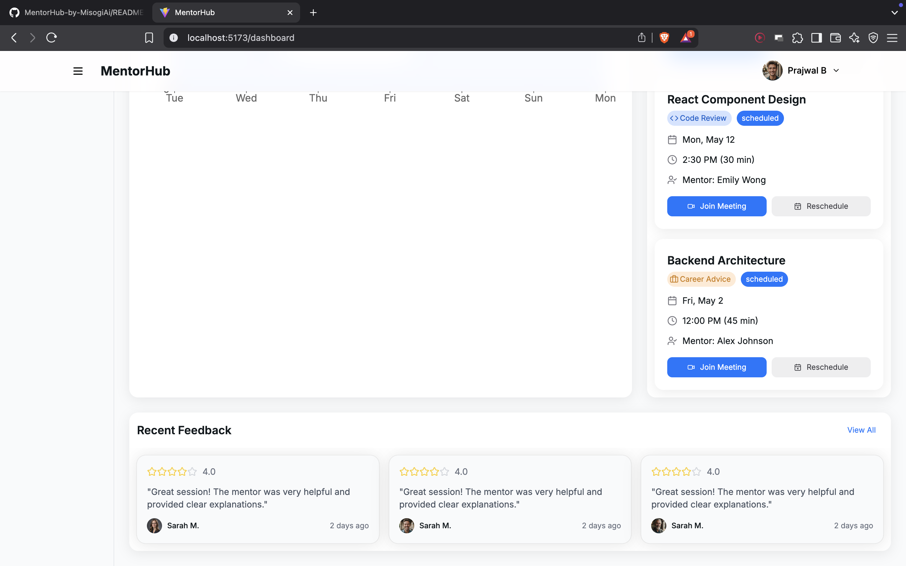
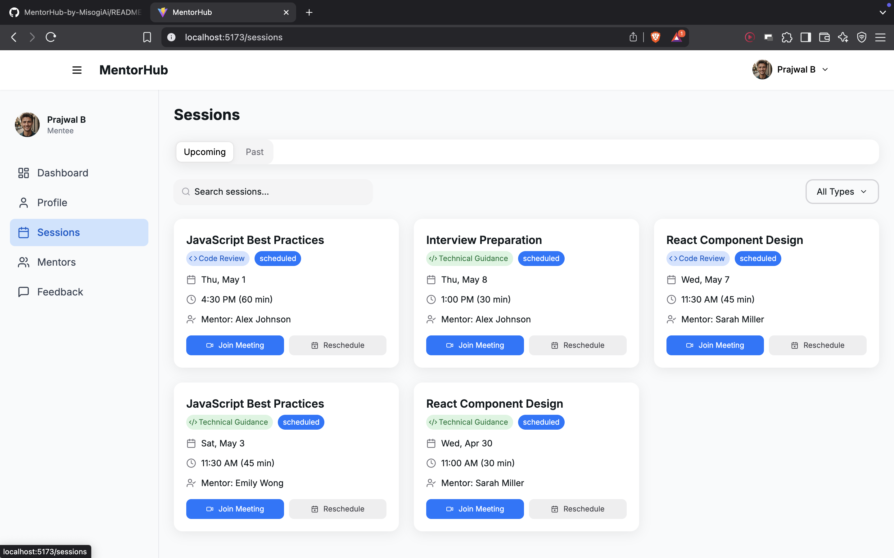
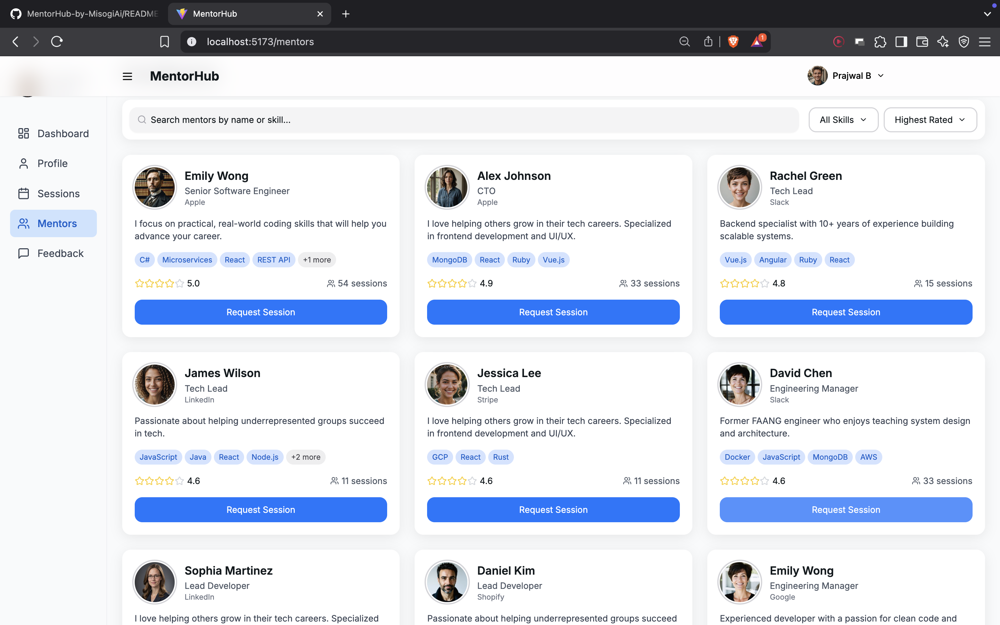
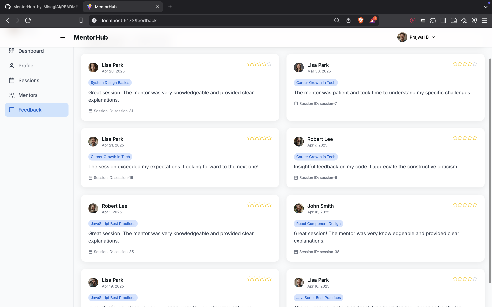

# MentorHub by Misogi

[](https://github.com/prajjugit/MentorHub-by-Misogi/stargazers)
[](https://github.com/prajjugit/MentorHub-by-Misogi/issues)
[](LICENSE)

> 🚀 MentorHub is a modern mentorship platform connecting mentors and mentees!

---

## 📸 Demo

[](https://your-demo-url.com)

<p align="center">
  
  
  
  
  
</p>

---

## 📚 Table of Contents

- [Features](#-features)
- [Tech Stack](#-tech-stack)
- [Getting Started](#-getting-started)
- [Usage](#-usage)
- [Contributing](#-contributing)
- [License](#-license)

---

## ✨ Features

- 🔐 User authentication (login/register)
- 👨‍🏫 Mentor directory & profiles
- 📅 Session booking and management
- 📊 Dashboard for users and mentors
- 📱 Responsive UI with Tailwind CSS

## 🛠️ Tech Stack

- [React](https://react.dev/)
- [Vite](https://vitejs.dev/)
- [Tailwind CSS](https://tailwindcss.com/)
- TypeScript

## 🚀 Getting Started

### Prerequisites

- Node.js (v16+ recommended)
- npm or yarn

### Installation

```bash
# Clone the repository
git clone https://github.com/prajjugit/MentorHub-by-Misogi.git
cd MentorHub-by-Misogi

# Install dependencies
npm install
# or
yarn install
```

### Running the App

```bash
npm run dev
# or
yarn dev
```

The app will be available at [http://localhost:5173](http://localhost:5173) by default.

## 📖 Usage

- Register or log in to your account
- Browse mentors and book sessions
- View your dashboard for upcoming sessions

<details>
  <summary>Advanced Setup</summary>
  
  - Configure environment variables in a `.env` file
  - Customize Tailwind or Vite config as needed
</details>

## 🤝 Contributing

Pull requests are welcome! For major changes, please open an issue first to discuss what you would like to change.

## 📄 License

[MIT](LICENSE)

---

<p align="center">
  Built with ❤️ by the Misogi team
</p>

### Prerequisites

- Node.js (v16+ recommended)
- npm or yarn

### Installation

```bash
# Clone the repository
git clone https://github.com/prajjugit/MentorHub-by-Misogi.git
cd MentorHub-by-Misogi

# Install dependencies
npm install
# or
yarn install
```

### Running the App

```bash
npm run dev
# or
yarn dev
```

The app will be available at [http://localhost:5173](http://localhost:5173) by default.

## Usage

- Register or log in to your account
- Browse mentors and book sessions
- View your dashboard for upcoming sessions

## Contributing

Pull requests are welcome! For major changes, please open an issue first to discuss what you would like to change.

## License

[MIT](LICENSE)

---

Built with ❤️ by the Misogi team.
